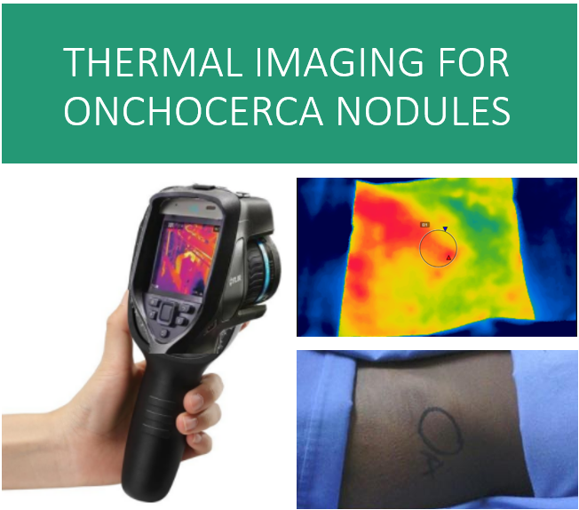
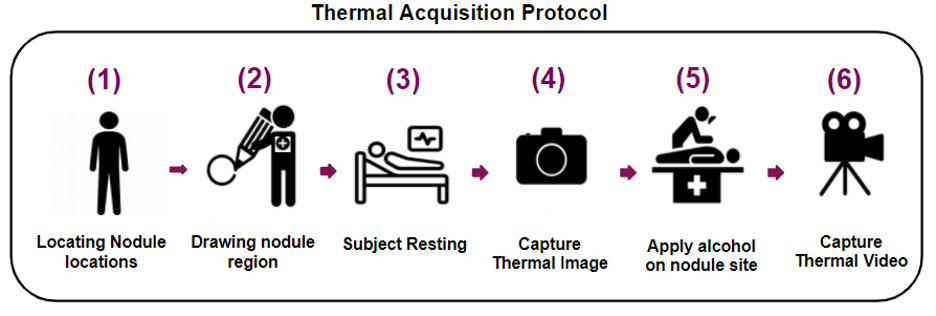
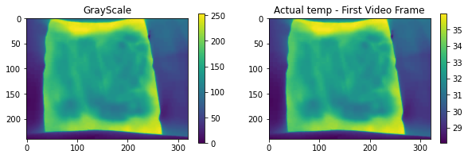
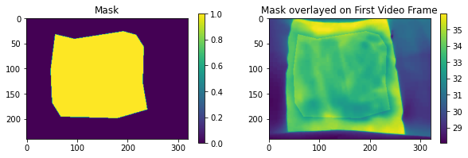
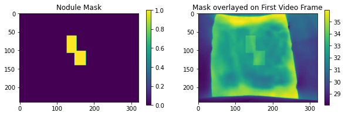

# Niramai Oncho Dataset #
<!--  -->
<p align="center">
  
</p>

> ***This is the first ever study where thermal Imaging, a non-invasive methodology captures thermal heat signature of the skin surfaces to assess the viability of female worms residing beneath the skin in nodules in subcutaneous tissue.***

>The study was conducted by **Niramai Team** in Grant support with ***Bill & Melinda Gates Foundation*** at Hohoe, Ghana. 

## Niramai Oncho Dataset ##

> Niramai Oncho Dataset is the dataset of thermal images and thermal videos - captured for various palpable nodule locations of 125 patients. Thermal Data is captured using the following acquistion protocol



* For more details about the study involving thermal imaging, onchocerciasis and evaluation. Refer [Evaluation of Non-Invasive Thermal Imaging for detection of Viability of Onchocerciasis worms](https://arxiv.org/abs/2203.12620)


> Niramai Oncho Dataset repository includes Data, Code and groundtruth.xlsx. Dataset description is provided below in detail. For any queries, please mail at contact@niramai.com with subject as *"Niramai Oncho Dataset"*

**Data Folder:**
1. It includes following folder directory structure:
    * Data/Patient ID/Locations/
2. Each folder includes (side = ***left*** or ***right*** ):
    * side.csv or side.npy : thermal image (raw temperature values)
    * side_aligned.npy: aligned thermal image (raw temperature values) 
    * side.avi : thermal video (grayscale format)
    * side_temp.csv: min-max temp file for video (actual min, max values for each frame)
    * croppoints.crpt: nodule and roi region polygon croppoints
3. Thermal video is stabilized and side_aligned.npy is aligned thermal image where misalignment between thermal image and video is corrected. To know more about misalignment and video stabilization. [Refer Section IIIA - *Alignment of Image snapshot and thermal video* ](https://arxiv.org/abs/2203.12620)
4. Thermal video is stored in grayscale format, to get actual temperature value - conversion code is provided in code folder.

**Code Folder:**
1. Sample code for converting video frame from grayscale format (0-255) to actual temperature value using min_max temperature file.
2. Sample code for nodule and roi segmentation from croppoints.crpt
3. Run Code/notebook.ipynb to access the code


**Groundtruth.xlsx:**
1. It includes following information:
    * Batch number of the patient
    * Patient ID
    * Location of nodule region i.e Trochanter, Sacrum, IIiacCrest, Knee, ChestWall etc
    * Side of nodule region: Left side, right side
    * Label: 0 - No alive female worm, 1 - Alive female worm, Blank - Histopath assessment unavailable
2. Batch B0 - B7 is used for training and validating the data while B8,B9,B10 belongs to prospective blind set.    

## Sample Code ##

```python
%load_ext autoreload
%autoreload 2
from utils import *
import matplotlib.pyplot as plt
```
> Recover actual temperature values of thermal video

```python
filename = "C:/users/ronakdediya/Desktop/Onchocerciasis/PPT/Data/IM95C2/IIiacCrest/left"
grayScale, actualvideoTempFrame = getActualVideo(filename)          
plotData([grayScale[0],actualvideoTempFrame[0]],["GrayScale","Actual temp - First Video Frame"])
```


    

    


> Obtain Alchol applied region of interest and nodule location using croppoints

```python
basepath = "C:/users/ronakdediya/Desktop/Onchocerciasis/PPT/Data/IM95C2/IIiacCrest/"
side = "left_1" ## Use "_1" as extension to your side for getting croppointsM

mask = getMaskFromCrpt(basepath,side)/255
plotData([mask,actualvideoTempFrame[0] + mask],["Mask","Mask overlayed on First Video Frame"])

noduleMask = getNodule(basepath,side)
plotData([noduleMask,actualvideoTempFrame[0] + noduleMask],["Nodule Mask","Mask overlayed on First Video Frame"])
```


    

    


    

    


This Dataset is licensed under a
[Creative Commons Attribution-NonCommercial-NoDerivatives 4.0 International License][cc-by-nc-nd].

[![CC BY-NC-ND 4.0][cc-by-nc-nd-image]][cc-by-nc-nd]

[cc-by-nc-nd]: http://creativecommons.org/licenses/by-nc-nd/4.0/
[cc-by-nc-nd-image]: https://licensebuttons.net/l/by-nc-nd/4.0/88x31.png
[cc-by-nc-nd-shield]: https://img.shields.io/badge/License-CC%20BY--NC--ND%204.0-lightgrey.svg

If you use the Niramai Oncho Dataset, ***please cite the following paper***:

> Dedhiya R, Kakileti ST, Deepu G, et al. Evaluation of Non-Invasive Thermal Imaging for detection of Viability of Onchocerciasis worms. Published online 2022. doi:10.48550/ARXIV.2203.12620
